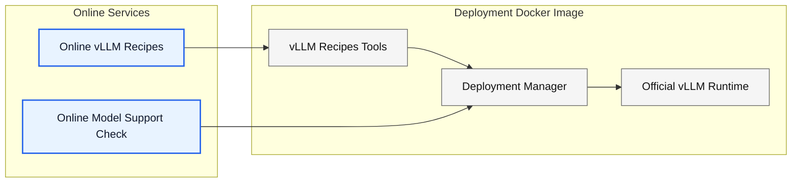
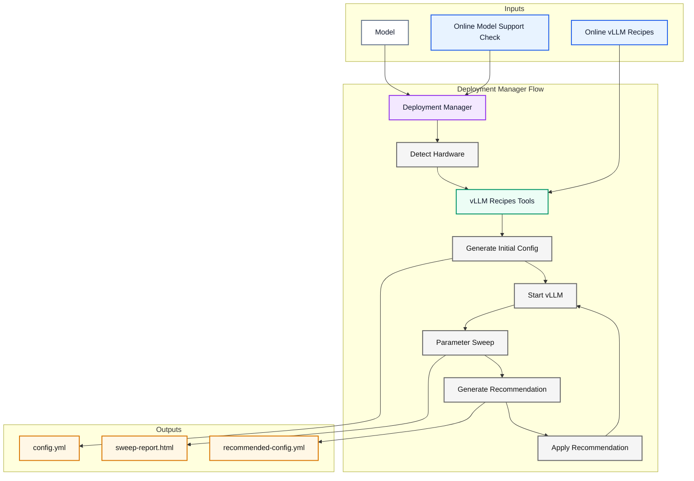

# vLLM Recipes Deployment Manager

This project provides a deployment manager built on the **official vLLM CPU
image** and uses **online vLLM Recipes** to configure and optimize model
serving.

## Key Benefits

- **No static model recipes in the Docker image**
- **Recipe updates do not require rebuilding the image**
- **New models added to vLLM Recipes can be deployed without changing the image**
- **Hardware-aware configuration based on the detected platform**
- **vLLM Recipes tools provide configuration, sweep, and recommendation**

## Architecture



The deployment image is based on the **official vLLM image** and adds the
**vLLM Recipes tools** and **Deployment Manager**. The manager uses online
services for **vLLM Recipes** and **model support checking**, while the vLLM
runtime and management components remain inside the deployment image.

### Deployment Manager Flow



The manager receives the model, **online model support check**, and **online
vLLM Recipes** as inputs. The deployment workflow runs top-to-bottom, and all
generated configuration and sweep artifacts are grouped together as outputs.

Inference clients connect directly to vLLM on port 8000. The manager remains
available on port 8080 and is not an inference proxy.

## Build

```bash
./scripts/prepare-recipes.sh
docker build -t vllm-recipes-manager:latest .
```

The preparation defaults are:

```text
VLLM_BASE_IMAGE=vllm/vllm-openai-cpu:latest-x86_64
VLLM_RECIPES_REPOSITORY=https://github.com/intel-ai-tce/vllm.git
VLLM_RECIPES_REF=recipe_improve
```

They can be replaced without changing this project. A commit SHA is recommended
for a repeatable build:

```bash
VLLM_RECIPES_REPOSITORY=https://github.com/intel-ai-tce/vllm.git \
VLLM_RECIPES_REF=d3eb8cb7d952024c82b161875fd0a7ac76aadd71 \
  ./scripts/prepare-recipes.sh

docker build \
  --build-arg VLLM_BASE_IMAGE=vllm/vllm-openai-cpu:latest-x86_64 \
  -t vllm-recipes-manager:latest .
```

For a reproducible production build, set `VLLM_BASE_IMAGE` to an immutable
image digest and stage Recipes from a tested commit SHA. The staged directory
records the resolved commit in `vendor/recipes/SOURCE_COMMIT`.

### Why Recipes is prepared outside Docker

The vLLM repository is large, and Docker/BuildKit may not share the host's
GitHub proxy configuration. A `git clone` inside the Dockerfile can therefore
time out even when GitHub is reachable from the host. The preparation script:

- fetches only one ref at depth one;
- uses Git partial-clone blob filtering;
- checks out only `tools/recipes` with sparse checkout;
- makes the subsequent Docker build independent of GitHub.

An interrupted manual clone named `vllm/` is excluded from the Docker build
context, so it will not accidentally make the context very large.

The running service still needs outbound access to `https://recipes.vllm.ai`
for recipe discovery and to the configured model source for model downloads.

## Run

```bash
mkdir -p state

docker run --rm \
  --shm-size=4g \
  -p 8000:8000 \
  -p 8080:8080 \
  -e EIM_MODEL_ID=meta-llama/Llama-3.1-8B-Instruct \
  -e HF_TOKEN \
  -v "$HOME/.cache/huggingface:/workspace/model-cache/huggingface" \
  -v "$PWD/state:/workspace/eim" \
  vllm-recipes-manager:latest
```

Open:

```text
Portal:           http://localhost:8080
OpenAI endpoint:  http://localhost:8000/v1
vLLM health:      http://localhost:8000/health
```

## Initial configuration

Every startup runs the required hardware-aware Recipes path before launching
vLLM. The manager first maps the host CPU to the Recipes hardware key, then
runs the converter:

```bash
python3 /opt/vllm-recipes/recipe_json_to_vllm_config.py \
  --model "$EIM_MODEL_ID" \
  --hardware "$DETECTED_RECIPE_HARDWARE" \
  --detect-hardware \
  --config-out /workspace/eim/config/initial-config.yml \
  --env-out /workspace/eim/config/active-env.sh
```

The manager copies the result to `active-config.yml`, safely parses the
generated exports, and launches:

```bash
vllm serve --config /workspace/eim/config/active-config.yml \
  --host 0.0.0.0 --port 8000
```

If the Recipes API has no matching model, or the model has no rendering for the
detected hardware, the manager stays available and displays a **Recipe
unavailable** alert. The alert distinguishes recipe availability from other
startup failures and provides an expandable recipe-generation log. When
`EIM_MODEL_SUPPORT_URL` is set, the manager also submits a fast, non-smoke-test
check to the vLLM CPU model-support service and displays its verdict in the
deployment alert. A supported verdict is advisory and does not start vLLM
without a tested recipe configuration.

### Automatic Xeon detection

`EIM_HARDWARE=auto` is the default and needs no special container privileges.
The manager reads the CPUID family and model exposed through `/proc/cpuinfo`:

| Detected processor | Recipes key |
| --- | --- |
| Emerald Rapids, 5th Gen Xeon Scalable | `xeon5` |
| Granite Rapids, Xeon 6 P-core | `xeon6` |
| Sierra Forest, Xeon 6 E-core | `xeon6` |

The resolved key and detection details are shown in the portal and returned by
`GET /api/hardware`. Unknown and future processors fail with an actionable
message instead of silently choosing the wrong recipe. Override detection only
when necessary, for example `-e EIM_HARDWARE=xeon6`.

### Optional NUMA-performance permissions

The minimum command deliberately omits `SYS_NICE` and unconfined seccomp. They
are not required to generate Recipes configuration, run the manager, or start
basic vLLM serving. On some hosts, vLLM's NUMA memory-binding calls may be
restricted without them. If logs show a binding/permission failure, test these
options after reviewing the security policy:

```bash
docker run --rm \
  --cap-add SYS_NICE \
  --security-opt seccomp=unconfined \
  ... \
  vllm-recipes-manager:latest
```

These broad permissions may be rejected by Kubernetes Pod Security or
OpenShift Security Context Constraints. Prefer the minimum command first and
add only the narrowly approved permission available in the target cluster.

## Maintenance sweep

The portal accepts input/output token lengths, representative concurrency,
and TTFT/TPOT SLAs. Starting a sweep:

1. Stops the active vLLM process.
2. Calls the converter with `--detect-hardware --generate-full-sweep`.
3. Runs the generated `run_full_sweep.sh`.
4. Saves all results under `/workspace/eim/jobs/<job-id>/sweep`.
5. Restarts the original active configuration.
6. Displays `recommended-config.yml` and `sweep-report.html`.

Applying the recommendation remains a separate action and restarts vLLM.

The manager restores the most recent sweep recorded in `state.json` after a
restart. It validates the saved job ID and refreshes report and recommendation
availability from the job directory. A sweep that was queued or running when
the manager stopped is restored as interrupted rather than running.

### Optional demo report

To show a previously generated, self-contained sweep report without treating
it as a live result or enabling recommendation application, copy it into the
persistent state directory:

```bash
mkdir -p state/demo
cp /path/to/sweep-report.html state/demo/sweep-report.html
```

The portal then displays a **View demo sweep report** button. The report stays
hidden and unloaded until the button is clicked. Because `state` is mounted at
`/workspace/eim`, the demo report is available to the running container
without rebuilding the image.

## Configuration

| Environment variable | Default | Purpose |
| --- | --- | --- |
| `EIM_MODEL_ID` | required | Model ID used for Recipes discovery |
| `EIM_HARDWARE` | `auto` | Auto-detect `xeon5`/`xeon6`, or explicitly set a Recipes key |
| `EIM_VLLM_PORT` | `8000` | Direct vLLM API port |
| `EIM_VLLM_WORKDIR` | `/vllm-workspace` | Runtime working directory used by vLLM and sweep subprocesses |
| `EIM_MANAGER_PORT` | `8080` | Portal and management API port |
| `EIM_STATE_DIR` | `/workspace/eim` | Persistent configs, jobs, logs and reports |
| `EIM_MODEL_SUPPORT_URL` | unset | Base URL of the optional vLLM CPU model-support service |
| `EIM_MODEL_SUPPORT_TIMEOUT` | `180` | Model-support request timeout in seconds |
| `EIM_API_TOKEN` | unset | Optional bearer token for mutating APIs |

For shared deployments, set `EIM_API_TOKEN` and place authentication in front
of port 8080. The first version is an administrative portal, not a public
security boundary.

## Current limitations

- One model and one local vLLM server are supported.
- The sweep intentionally interrupts inference.
- Most configuration changes require a vLLM restart.
- Only the most recent persisted sweep is restored; browsing all historical
  jobs is not implemented yet.
- `scripts/prepare-recipes.sh` requires host access to the configured Recipes
  Git repository; the Docker build itself does not.
- Automatic mapping currently covers Xeon 5 and Xeon 6. Xeon 4 and unknown
  processors require an explicit supported Recipes key.
- The manager remains available when recipe generation or vLLM startup fails,
  so the user can inspect the error and logs.
